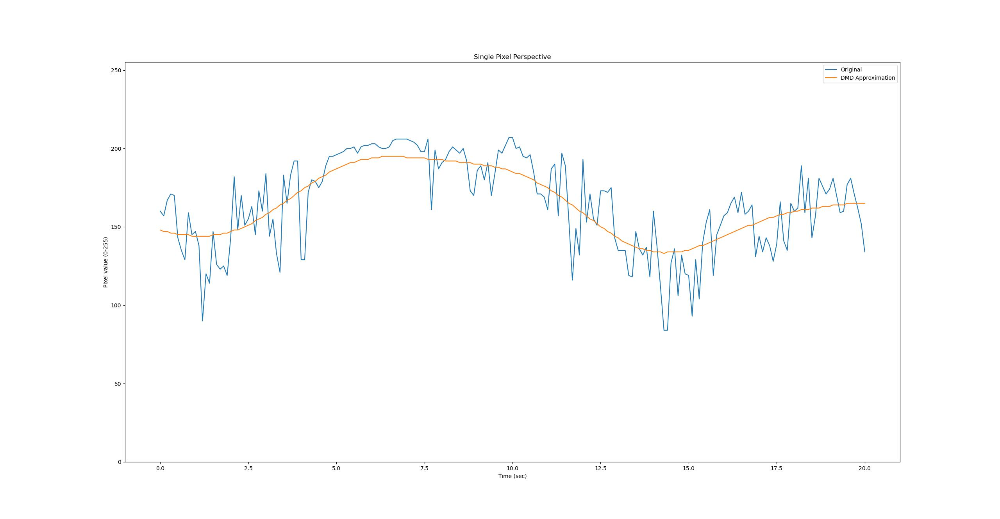
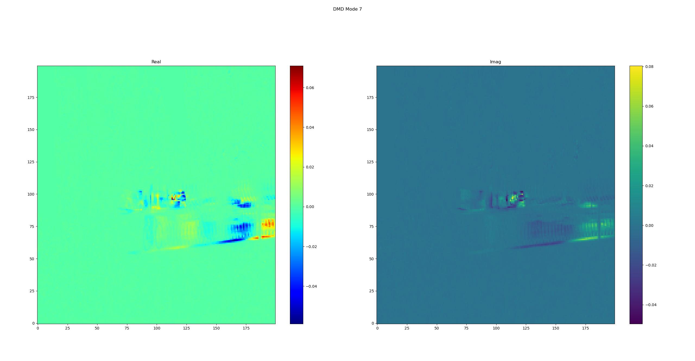
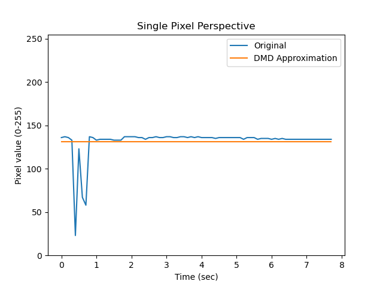

# DMD - Dynamic Mode Decomposition

DMD simultaneously computes a set of Fourier series approximations for
a set of input sensor signals. The solution will share a common set of
basis functions, and each sensor will have a unique set of weightings
for each basis function.  The input data set can be reconstructed from
the set of weightings (modes) and the basis functions (frequency,
phase, amplitude.)

Notice that for each individual sensor, the DMD-based Fourier series
approximation will not be as accurate as computing the Fourier series
for each individual sensor due to the additional constraint of sharing
a common set of basis functions.  However, DMD offers the advantage
of exposing common dominant frequency information (modes) across the
entire array of sensors.  When we plot mode information in it's
correct spatial relationship, we can begin to visualize motion
characteristics in the data set.

## Constraint #1: Sampling Time Interval

It only makes sense to perform DMD on a set of data if all the sensors
have been sampled at a constant time interval.  This is mentioned in
the literature.

## Constraint #2: Sensor/Sampling Locations

I have not found anywhere in the literature a requirement that the
sensors must maintain a fixed position within the system.  Is this so
obvious that no one thought to mention it?  So brilliant that no one
thought to try it?  Is this a true requirement and can it be relaxed?

In all DMD literature I have encountered, there is an assumption that
the sensor locations are fixed through the course of the experiment
and this location is used to interpret the frequency response at that
specific location in the experiment.

If sensors can move arbitrarily through the system during the
experiment they will be sampling the system state at different
locations.  Can frequency information or modes be used to separate out
the dynamics of the system versus the dynamics of the sensor?

Jumping ahead, if we think of DMD as a Fourier series approximation to
the value of a set of sensors over time, what does that mean if
sensors can move arbitrarily (unpredictably and unmeasurably) through
the system?  We will still compute an approximation to the signal, but
does the result hold any meaningful information with respect to the
frequencies and weightings?

# Terminology

## Definition: Modes

Consider a system that has "n" sensors which are sampled at "m" time
steps and we solve for "k" frequencies.  DMD will compute a set of "n"
weightings for each of the "k" basis functions (frequencies.)  The
frequencies can be evaluated along with phase/amplitude information at
each of the "m" time steps.

We can refer to a set of "n" weightings associated with a single
frequency as a **mode.** Notice in the following plot the "x" axis is
each pixel (sensor) position The vertical axis is the mode weights.
In this example the input data set is a 200 x 200 image ("n" = 40000
pixels) and we solved for "k" = 9 basis functions.)

## Definition: Dynamics

We can evaluate the shared basis functions for the Fourier series at
each time step.  This is called the **dynamics.**

The modes (the set of weightings) is fixed for the entire solution and
the dynamics changes with respect to time.  For the dynamics plot, the
horizontal axis is time and the vertical axis is amplitude.  Also note
that in the input video for this plot, there was motion at the
beginning, but very little motion at the end which corresponds to
diminishing dynamics over time.)

## Definition: Pixel Motion

Consider a video clip with an object moving through the frame.  It is
tempting to think of the group of pixels as "moving together" because
that is how our brain interprets what it is seeing.  However, it may
be important to remember that from the perspective of individual
pixels (sensors), they are just sensing values that are changing with
respect to time.  Pixels don't have a velocity vector.  The change in
value from one frame to the next is not velocity, it's just the
intensity of the pixel changing value.  In the next section I show the
value of an individual pixel plotted over time.

# Reconstructing the original sensor data

Once the DMD modes and dynamics have been computed, these can be used
to reconstruct an approximation of the original data set at any time
step.

At a conceptual level Each pixel is reconstructed individually,
however in practice we would use block (matrix) operations to
reconstruct an entire frame of video in one step.

To reconstruct an approximation at each time step, simply sum the
product of each mode (weighting) multiplied by it's respective basis
function evaluated at that time step.

The example below show the original time series pixel data compared to
the Fourier series approximation as computed by DMD.  As a side note,
with the output of the DMD algorithm, the value of every pixel at
every time step can be approximated.  Thus it is possible to
reconstruct (an approximation to) the entire input video using only
the modes and the basis functions.

Notice the reconstructed fit for each individual sensor with DMD will
not be as accurate as if a Fourier series was computed for each sensor
independently due to the shared frequencies in the DMD solution.

# More About Modes

The modes (the set of sensor weightings for each basis function) can
directly provide insight into the motion of the system.  In fluid
dynamics the modes can expose the complex structures forming the
dynamics of the system.  Another way to say this is that mode
(weighting) shows how responsive each sensor is to each frequency.

## Modes and video

Consider processing a sequence of video frames through the DMD
algorithm.  The fixed time interval constraint is naturally achieved.
If the camera is not moving, then the spatial location of each sensor
remains fixed.

Reminder: the sum of the (weighting * basis function) is used to
reconstruct an approximation to a original pixel value at any time
(each pixel represents a fixed point in space.)

Cherry picking an arbitrary mode from an arbitrary stationary video
with an object moving through as an example, the mode plot could look
like the following.  This plot shows some energy at some particular
frequency at some specific locations in the video frame. It shows zero
energy in all the background (not changing) positions. In this case
the X and Y axes are pixel locations in the original video.  This
allows us to "see" where energy at some frequency has occurred:

## Problem #1: Separating the amplitude of the input signals versus response at that frequency.

Remember that fundamentally DMD computes a Fourier series
approximation to the original data set.  We can use the output of DMD
to reconstruct the original pixel values at any time "t".  Consider
that some pixels values will be small (dark regions) and some pixel
values will be large (light regions.)  To properly reconstruct the
original value, those dark pixels will have a low mode weighting,
while the bright pixels have a much higher relative weighting.  Thus,
the video content is mixed with the frequency response when processing
video.  There is not way to directly separate if a low mode value
(weighting) means a low response at that frequency, or the original
pixel was just a dark pixel.

## Problem #2: Impulse changes (step changes)

Consider the following "video" (just one frame is shown.)  An
arbitrary pixel is selected and shown in the green circle.  Full DMD
is performed for the entire 7.7 second video clip using a maximum rank
of 9 (9 basis functions for the Fourier series approximation.)

As the bike rides "through" the chosen pixel, here is the pixel value
over time.  Hopefully anyone that has seen demonstrations of using
Fourier series to approximate step functions or square waves in other
contexts can see the periodic nature of the Fourier approximation and
the need for a high number of terms to accurately approximate the
sharp changes in the original time series of the pixel.

It turns out that real world video motion generally acts in the same
way.  At the pixel level (looking at the time history of a single
pixel) the values change more like a random unpredictable step
function than in any other way.

**The important take away:** When there is visual motion in video
(either due to objects moving or the camera moving) the Fourier series
approximation shows energy at all the different non-zero frequency
modes, and also a need for a high number of terms to accurately
approximate the original time series step behavior.

This means that DMD can show the difference between moving or
non-moving regions of video, but in the general case, very little
useful information can be extracted from the non-zero frequency modes
beyond determining areas that have pixel values change versus areas
with constant pixel values (background.)

# The stationary camera hack

With DMD the zero-frequency mode corresponds to the steady state value
of each pixel.  Conceptually this is **very** similar to the average
value of the pixel over the time spanned by the video clip.  It is
technically not exactly the same as the average, but it is very very
close, and close enough that the end results could be though of
intuitively as equivalent.

Consider the plot of the same arbitrarily selected pixel in the
previous example (with the bike passing through it.)  Here is the plot
of the original pixel value versus the value of the DMD zero frequency
mode approximation.

Next is a plot of the zero frequency weightings (the zero frequency
mode.)  As you can see the bike has been [almost] entirely removed
from the scene.  This is the DMD magic for scene segmentation.  This
is the critical observation that allows DMD to be applied to visual
scene segmentation in video.

The foreground (moving) portion of each frame could be reconstructed
by summing the non-zero frequency modes (sum of weights *
basis_function).  However it is generally easier (and faster) to
simply subtract the background from the current frame because the sum
of all the modes is the full approximation to the original scene.

# Consider a moving camera

Now imagine a camera on a UAV that is going through some combination
of translation and rotation.

We now know:

* DMD is computing a Fourier series approximation for each pixel using
  a shared set of frequencies, but with individual (per pixel)
  weightings.

* Pixel value changes over time in video most closely approximate step
  or impulse changes and generally do not have meaningful frequency
  information beyond changing vs. not changing.

* Translating or rotating the camera is similar to changing sensor
  positions in a fluids experiment.  The sensor is now sampling a
  different point in the system.

At first glance, there is a hope that some subset of DMD
frequencies/modes would correspond to the movement of the scene due to
camera motion.  We can look at video and observe pixels moving though
the scene so intuitively it seems like there must be some useful
frequency domain information we could extract from DMD.

However, an important distinction is that pixels or groups of pixel
are not actually moving through the scene, this is just an animation
illusion created by independently changing the values of individual
pixels.  Our eyes/brain connects the dots and does the rest.

DMD (Fourier series approximation) is approximating the time series
for each individual pixel.

Still, can we look at the modes (the per-pixel weightings for each
frequency) and gain insight into the motion of the scene?  I argue the
answer is no in the general case of drone style surveillance video.
(1) The weightings are convoluted with pixel brightness (2) The time
series change in any pixel value is not a periodic function.

We can still segment changing pixels from non changing pixels, but in
moving video, generally all the pixels are changing so this is not a
useful distinction.

# Moving Video Example

Consider a video with a dynamic moving camera (chase quad) and a
dynamic subject (aerobatic aircraft.)

Visually you can see the original video frame in the first grid
location.  Then moving to the right you see the zero frequency mode
(top center) which visually looks very much like an average of the
input frames (as we would expect).  But because the camera is moving,
the input frames get smeared together (as we would expect.)

Looking at the other non-zero frequency modes, we can see the all the
elements described above.  All the motion shows up in all the modes,
the edges of areas show up as step changes as they "move" through the
scene.

In the case of a stationary camera we can look at the zero frequency
mode and observe it is the background without the moving elements.

In the case of a moving camera we can view all the different modes
(and animate them throughout the course of the moving video), but we
do not see any modes that contain clear information with respect to
segmenting the moving parts of the scene from the static background.
The information we were hoping to extract just isn't there in the way
we hoped.  Hopefully the information and background provided
throughout this document kept this from being a surprise.

# Conclusion and future work

If the primary goal is to segment a challenging and highly dynamic
scene such as shown in the final example, then this isn't the end of
the story.  But I hope I have shown that DMD may not provide
sufficient information to be a large part of the answer.