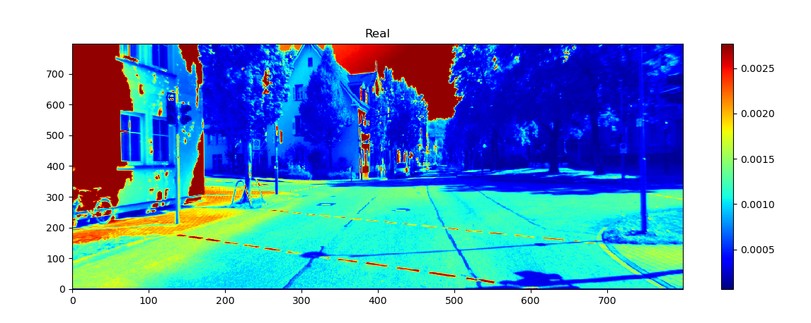
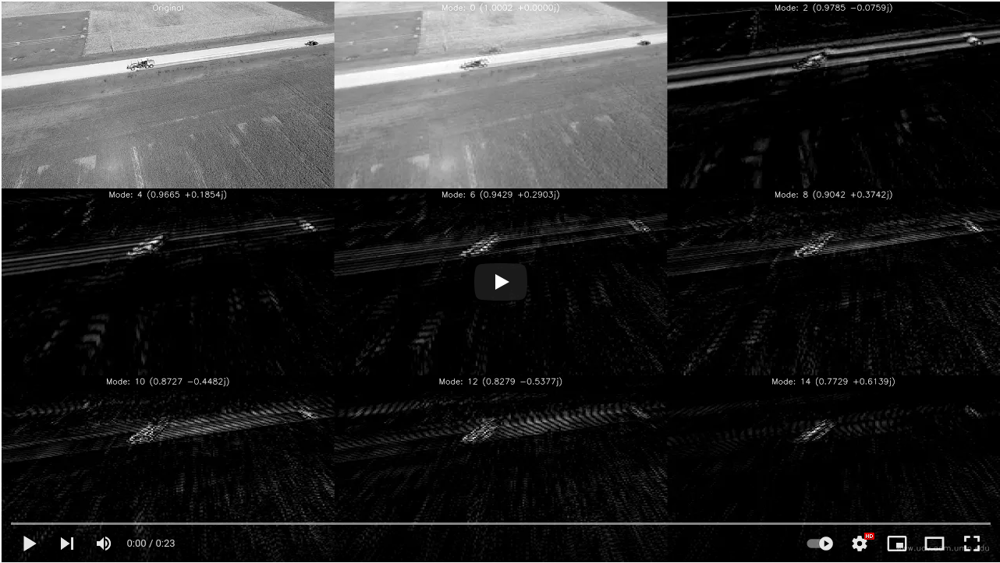
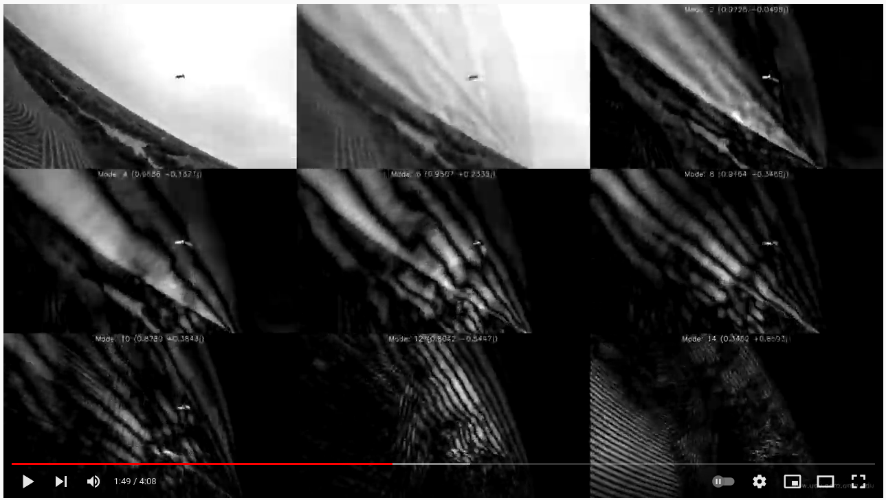

# DMD-Based Scene Segmentation for Video?

DMD does an impressive job of seperating the stationary background
from moving foreground.  Can this approach be adapted to work with a
moving camera?

## Stationary Camera Example

The following demo video is captured from a stationary camera.  The
original scene is in the upper left.  The zero-mode frequency is top
center.  The next 7 most dominant modes fill the remaining grid
locations.

You can see that the zero-frequency mode hides most of the motion as
the video plays through.

The following false color plot of the zero frequency mode of this
video shows just how nice a job DMD does at separating out the
stationary background from the moving items.

## Moving Camera Example

Consider the following example of a moving drone following a moving
vehicle.  The video begins with the drone stationary (similar to the
previous example), but after a few seconds the drone begins to move
forward and pan & tilt the camera to follow the vehicle motion.

As the drone begins to move, watch what happens to the modes.  Does
the zero-frequency mode (top center) now show only the background?  Do
any of the other modes isolate background versus foreground motion?

Hopefully you can see that all the motion of the moving camera and the
moving vehicle gets blended together in all the modes.  There isn't
any clear separation between different types of motion.

Also notice how the road edges and background feature edges show up.
Think back to how a Fourier series needs many terms to begin to
closely approximate a step function.  Edges of areas in moving video
act like step functions as those features move over individual pixel
sensors.

Here is a false color plot of the zero frequency mode showing all the
motion (camera and vehicle) blended together.  As with stationary
camera video, the zero frequency mode multplied by the corresponding
basis fucntion is essentionally an average of the input frames:

If you are curious, here I've singled out an arbitrary pixel in the
video and show how it's value changes as the camera moves, versus the
DMD approximation to t his pixel over time.

**Take away**: By examinging the DMD modes for moving video, can we
see any evidence of motion segmentation? Answer: no, nothing pops out.
Thus DMD by itself doesn't provide meaningful scene segmentation
information with moving video.

# End of content ... what follows is left over stuff I still need to go through.

Only using Fourier frequencies or weights (modes) computed for each
sensor position, could that information be used to separate out the
dynamics of the system versus the dynamics of the sensor?  This is the
primary question.  My goal of this paper is to demonstrate that this
is not possible in any general case.

Jumping ahead, because DMD is simply a Fourier series approximation to
the value of a set of sensors over time, what does that mean if
sensors can move arbitrarily (possibly unpredictably and unmeasurably)
through the system?  The signal at each sensor will be approximated,
but does that signal hold meaningful information in the frequency
domain when the sensor is moving through the system?

Notice that for each individual sensor, the DMD-based Fourier series
approximation will not be as accurate as computing the Fourier series
for each individual sensor due to the additional constraint of sharing
a common set of basis functions.  However, DMD offers the advantage
of exposing common dominant frequency information (modes) across the
entire array of sensors.  When we plot mode information in it's
correct spatial relationship, we can begin to visualize motion
characteristics in the data set.
# Consider a moving camera

Now imagine a camera on a UAV that is going through some combination
of translation and rotation.

We now know:

* DMD is computing a Fourier series approximation for each pixel using
  a shared set of frequencies, but with individual (per pixel)
  weightings.

* Pixel value changes over time in video most closely approximate step
  or impulse changes and generally do not have meaningful frequency
  information beyond changing vs. not changing.

* Translating or rotating the camera is similar to changing sensor
  positions in a fluids experiment.  The sensor is now sampling a
  different point in the system.

At first glance, there is a hope that some subset of DMD
frequencies/modes would correspond to the movement of the scene due to
camera motion.  We can look at video and observe pixels moving though
the scene so intuitively it seems like there must be some useful
frequency domain information we could extract from DMD.

However, an important distinction is that pixels or groups of pixel
are not actually moving through the scene, this is just an animation
illusion created by independently changing the values of individual
pixels.  Our eyes/brain connects the dots and does the rest.

DMD (Fourier series approximation) is approximating the time series
for each individual pixel.

Still, can we look at the modes (the per-pixel weightings for each
frequency) and gain insight into the motion of the scene?  I argue the
answer is no in the general case of drone style surveillance video.
(1) The weightings are convoluted with pixel brightness (2) The time
series change in any pixel value is not a periodic function.

We can still segment changing pixels from non changing pixels, but in
moving video, generally all the pixels are changing so this is not a
useful distinction.

# Moving Video Example

Consider a video with a dynamic moving camera (chase quad) and a
dynamic subject (aerobatic aircraft.)

Visually you can see the original video frame in the first grid
location.  Then moving to the right you see the zero frequency mode
(top center) which visually looks very much like an average of the
input frames (as we would expect).  But because the camera is moving,
the input frames get smeared together (as we would expect.)

Looking at the other non-zero frequency modes, we can see the all the
elements described above.  All the motion shows up in all the modes,
the edges of areas show up as step changes as they "move" through the
scene.

In the case of a stationary camera we can look at the zero frequency
mode and observe it is the background without the moving elements.

In the case of a moving camera we can view all the different modes
(and animate them throughout the course of the moving video), but we
do not see any modes that contain clear information with respect to
segmenting the moving parts of the scene from the static background.
The information we were hoping to extract just isn't there in the way
we hoped.  Hopefully the information and background provided
throughout this document kept this from being a surprise.

# Conclusion and future work

If the primary goal is to segment a challenging and highly dynamic
scene such as shown in the final example, then this isn't the end of
the story.  But I hope I have shown that DMD may not provide
sufficient information to be a large part of the answer.