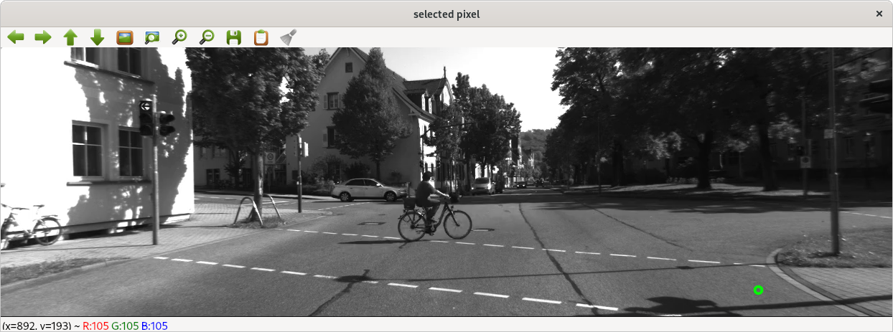
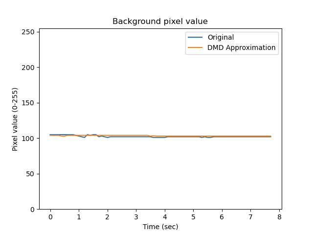
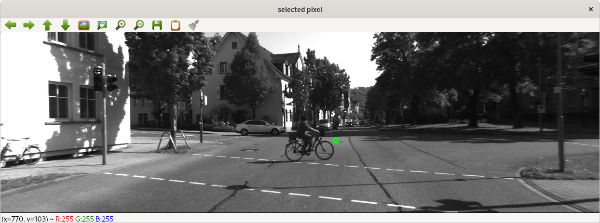
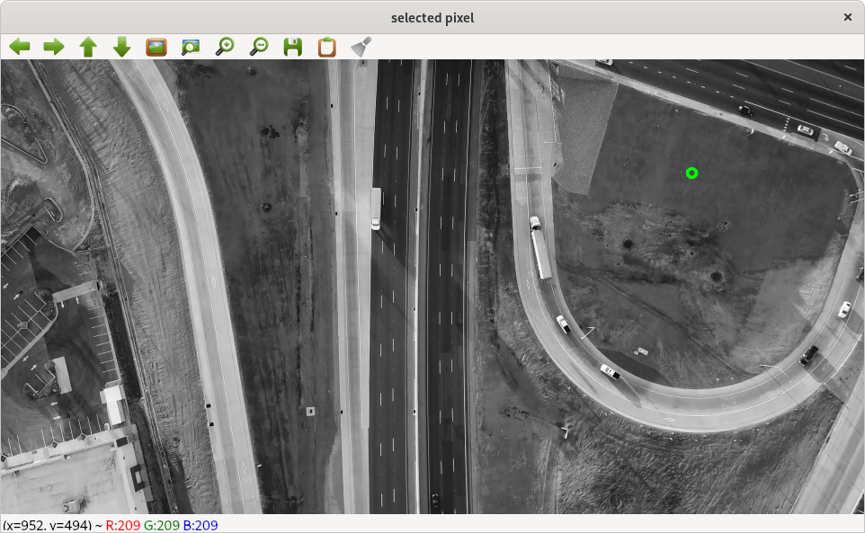
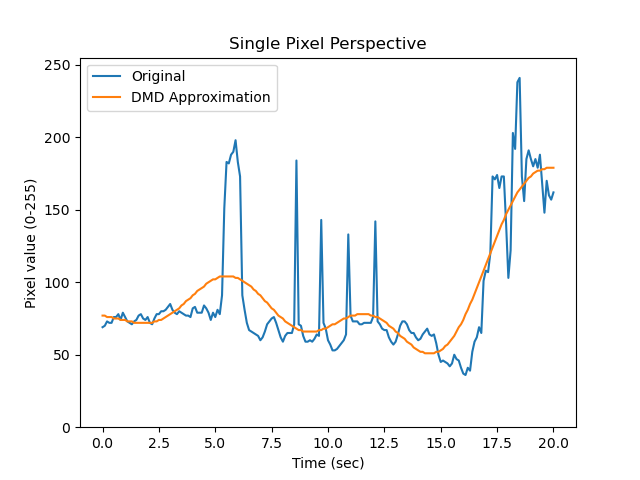

# Thoughts on using DMD from a moving camera

DMD = Dynamic Mode Decomposition

The main objective of this letter is to think about DMD from the
perspective of an individual pixel (or sensor) and clarify what DMD
can and can't do.

## Adjacency (in space)

The ordering of the input vector elements does not affect the
correct output of the algorithm.  If the input is an image, the grid
of pixels can be stacked by columns, stacked by rows, or even assigned
a pseudo-random order, as long as this is done consistently for each
time step and the chosen arrangement is reversed before interpreting,
plotting, visualizing the results.

The DMD algorithm finds a set of modes that is a simultaneous best fit
for the collection of sensors.  Sensors are grouped in the sense of
like behavior in the frequency domain but not in the sense of physical
location or adjacency.

## Visual motion of groups of pixels (aka blobs)

Consider the apparent motion of a group of adjacent pixels.  Our
eyes/brain does scene segmentation and motion tracking to interpret
the scene.  An animated video is just a collection of frames where
each frame is an array of pixels.  Each pixel can take any value at
any time step independent of its neighbors.  Video motion is simply an
animation of individual frames of input being shown in quick
succession.

From the perspective of an individual pixel, its value changes over
time, but the pixel itself is unaware of larger structures in each
frame or the frame-to-frame motion of the video.

If we plot the value of an individual pixel from the video animation
in the time domain, the plot will more closely match a step function
(or a sequence of step functions) than any other type of function.

## DMD-based scene segmentation in video from a static camera

When the camera is not moving, pixels representing the static
background portion of a scene should not change (or change just a
little due to things like sensor noise or the camera adjusting its
exposure, etc.)

Applying DMD to a video sequence from a static camera produces a zero
frequency mode that correspondes to the non-changing pixels in the
video.  (Notice the DMD zero frequency mode maps directly to simply
averaging the frames of video together.)

Each frame can then be segmented into background (non-moving portion)
versus foreground (moving portion) by subtracting the background from
the current frame of video. Whatever pixels are different from the
background value are considered the non-zero frequency (moving)
segment of the frame.

This works well, and DMD is a success when the camera is not moving.
However, we generally cannot extract much useful information beyond
zero frequency vs. non-zero frequency.  Due to the step function
nature of individual pixel changes, the mode frequencies do not convey
useful information about the change or the speed or direction of the
larger strucuture movements in the video across the array of pixel.

Also observe that simply averaging frames is an O(n) operation for
each time step and also achieves the same result as computing the DMD
zero frequency mode.

## Example #1

Consider a static (fixed position) camera.  DMD is performed with a
max rank of 10.  (Motion is best approximated with 10 modes.)

**Background (zero frequency) pixel**

Consider the pixel highlighted in green below it is part of the static
background so it changes minimally through the movie animation.

Here is a plot of the pixel value over time:

**Moving/changing (non-zero frequency) pixel**

Consider the next pixel highlighted in green below it undergoes changing values as the bicycle rides across the scene.

Here is a plot of the pixel value over time:

## DMD-based scene segmentation in video from a moving camera

Now consider that the camera is moving.  The static background will
appear to be moving in the video.  Our eyes/brain will do a good job
of interpreting this and understanding the scene.

However, DMD is mapping the values of each individual pixel to the
frequency domain, so we need to consider the camera motion from the
perspective of an individual pixel.  Again, similar to motion in a
static camera, motion of the background (for the perspective of an
individual pixel) acts more like a step function than any other
function.

Because the camera is moving and all the pixels are now subject to
change, the trick used in the fixed-camera use-case no longer works
and can't be directly extended in any useful way.  This is bad news,
but not the end of the story.

## Example #2

Consider a dynamic (moving position/orientation) camera.  DMD is
performed with a max rank of 10.  (Motion is best approximated with 10
modes.)

Consider the pixel highlighted in green below.  As the scene scrolls
(from top to bottom) the pixel will pass over a road with dark
pavement and white lines.  Notice that as is passes over areas of
relatively constant shading, the pixel value will not change much, but
as objects pass through the pixel, the value will have sharp changes.
These changes are typically not periodic.  Like in the static camera
case, DMD will tell us when pixel is static versus when it changes,
however unlike the static case, with a dynamically moving camera, we
must assume constant and unpredictable pixel value changes.

Here is a plot of the pixel value over time:

## Conclusion/Question

What can we see in the DMD modes or frequencies or dynamics that sheds
light on scene segmentation for a moving camera?  I don't see a direct
path to extracting useful information.

I have developed a simple method to model the camera motion using a
homography matrix from one frame to the next.  This doesn't account
for perceived motion due to parallax, but does enable variations on
the traditional background subtraction methods.

It would be possible to run DMD on the frame differences.  Here the
zero frequency mode would best correspond to the moving segment of the
scene.  See also note about zero frequency mode / frame averaging
equivalence.  So DMD could be used, maybe with indirect value of
filtering higher frequency noise?  But with less direct value towards
scene segmentation.